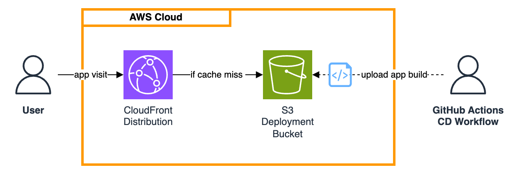

# aws-cdk-react-template

This project is a template for creating a React application hosted on AWS and deployed using the AWS Cloud Development Kit (CDK).
It consists of two TypeScript projects using NPM:

## Frontend Project
See the [frontend package.json](frontend/package.json) for relevant scripts.

## Infrastructure Project
See the [infrastructure package.json](infrastructure/package.json) for relevant scripts.

Deploy the infrastructure using the following commands:
```bash
npm run deploy -- --profile <profile> --region <region> --context config=dev
```

The [cdk.json](infrastructure/cdk.json) file tells the CDK Toolkit how to execute your app.

### Infrastructure Overview


### Custom Configuration Settings
The [infrastructure/config.ts](infrastructure/src/config.ts) reads the configuration specified by the `--context config=<CONFIG_NAME` parameter when deploying the CDK stack.
Defined settings can be passed to underlying constructs.


## GitHub Actions CI/CD
This project uses GitHub Actions for CI/CD. Two workflows are defined in the [.github/workflows](.github/workflows) directory:
- [ci.yml](.github/workflows/ci.yml) - runs on every push to any branch except `main`
- [cd.yml](.github/workflows/cd.yml) - runs on every push to `main` and deploys the application to AWS

To use the CD workflow and deploy the application an AWS account, you need to set up the following secrets in your GitHub repository:
- `AWS_ACCESS_KEY_ID`
- `AWS_SECRET_ACCESS_KEY`

Before the first deployment, you may need to bootstrap the CDK in your AWS account (see: [Bootstrapping](https://docs.aws.amazon.com/cdk/v2/guide/bootstrapping.html)).:
```bash
npx cdk bootstrap aws://<account>/<region>
```
